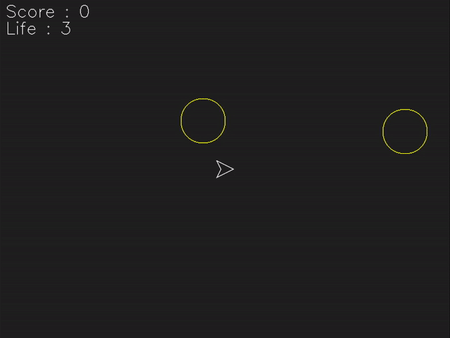

## Asteroids 🕹️ ☄️
  

    

  

**Asteroids** is a shoot'em up video game published by Atari Inc. in 1979.
The goal is to survive as long as possible by shooting the asteroids that are coming at us.

This game was developed as part of a school project to learn about the C language and the SDL library.

## Commands 
- forward = up arrow
- move back = down arrow
- go right = right arrow
- go left = left arrow
- teleport = Q key
- fire = space
